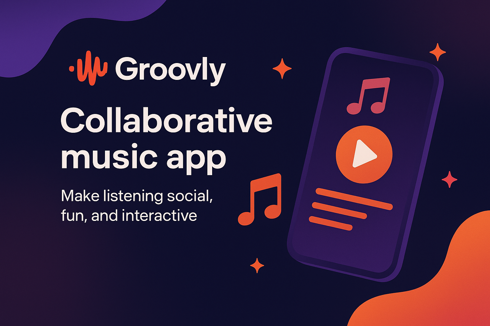

<div align="center">
  <div align="center">
  <!-- Uncomment when banner is ready: -->
  


<p align="center">
   <b>Welcome to Groovly!</b> Transform any gathering into a collaborative concert with our real-time music collaboration platform. Whether it's a house party, road trip, or study session, Groovly lets everyone add songs, vote on the queue, and create the perfect shared soundtrack together! 🎶🎵✨
</p>

<p align="center">
  <a href="#-overview">Overview</a> •
  <a href="#-key-features">Key Features</a> •   
  <a href="#-tech-stack">Tech Stack</a> •
  <a href="#-getting-started">Getting Started</a> •
  <a href="#-contributing">Contributing</a> •
  <a href="#-faqs">FAQs</a> •
  <a href="#-license">License</a>
</p>

---

</div>

[](https://opensource.org/licenses/MIT)
[](https://reactjs.org/)
[](https://www.typescriptlang.org/)
[](https://nextjs.org/)

[](https://tailwindcss.com/)
[](https://nodejs.org/)
[](https://socket.io/)
[](https://www.mongodb.com/)

</div>


---

##  Overview

Groovly is a real-time collaborative music experience platform that brings people together through shared soundtracks. Powered by WebSocket technology and seamless YouTube integration, Groovly creates instant party rooms where every guest becomes a DJ.

Whether you're hosting a house party, embarking on a road trip, or just hanging out with friends, Groovly transforms music listening into a democratic, interactive experience. Guests can add songs to the queue, vote on what plays next, and watch the vibe evolve in real-time.

With multiple room modes (Democratic voting, DJ Mode, and Auto-play), YouTube player integration, and real-time synchronization, Groovly ensures everyone's voice is heard. No more arguing over the aux cord – let the crowd decide!

Built with modern web technologies and a focus on seamless user experience, Groovly makes every gathering more engaging, inclusive, and memorable.

---

##  Key Features

<table>
  <tr>
    <tr>
        <td>
            <h3>🎵 Real-Time Collaboration</h3>
            Instant music synchronization powered by Socket.io - everyone hears the same beat at the same time.
        </td>
        <td>
            <h3>🗳️ Democratic Voting</h3>
            Let the crowd decide! Upvote songs to push them to the top of the queue.
        </td>
    </tr>
    <tr>
        <td>
            <h3>🎧 Multiple Room Modes</h3>
            Choose between Democratic voting, DJ Mode (host controls), or Auto-play for different vibes.
        </td>
        <td>
            <h3>🎬 YouTube Integration</h3>
            Seamless YouTube player with search functionality and instant song additions.
        </td>
    </tr>
    <tr>
        <td>
            <h3>🔗 Easy Room Sharing</h3>
            6-character room codes make joining parties effortless - no complex invites needed.
        </td>
        <td>
            <h3>🎨 Stunning Animations</h3>
            Dynamic CD drawer animations, smooth transitions, and eye-catching visuals powered by Framer Motion.
        </td>
    </tr>
    <tr>
        <td>
            <h3>🔐 Secure Rooms</h3>
            JWT authentication and room-based authorization ensure your party stays private.
        </td>
        <td>
            <h3>⚡ Host Playback Control</h3>
            Synchronized playback across all devices - host controls play, pause, skip, and seek in real-time.
        </td>
    </tr>
  </tr>
</table>

---

##  Tech Stack

### Frontend

- **Framework:** [Next.js 14](https://nextjs.org/) 
- **Language:** [TypeScript](https://www.typescriptlang.org/) 
- **Styling:** [Tailwind CSS](https://tailwindcss.com/) 
- **Animations:** [Framer Motion](https://www.framer.com/motion/) 
- **State Management:** [Zustand](https://github.com/pmndrs/zustand) 

### Backend

- **Runtime:** [Node.js](https://nodejs.org/) 
- **Framework:** [Express](https://expressjs.com/) 
- **Database:** [MongoDB](https://www.mongodb.com/) 
- **Real-time:** [Socket.io](https://socket.io/) 
- **Authentication:** [JWT](https://jwt.io/) 

### APIs & Services

- **Video Platform:** [YouTube API](https://developers.google.com/youtube)
- **HTTP Client:** [Axios](https://axios-http.com/)

---

##  Getting Started

Follow these steps to set up and run Groovly locally:

### Prerequisites

- Node.js (v14 or higher)
- MongoDB (local installation or MongoDB Atlas account)
- npm or yarn

### Backend Setup

1.  **Navigate to backend directory:**

    ```bash
    cd M-Backend
    ```

2.  **Install dependencies:**

    ```bash
    npm install
    ```

3.  **Set up Environment Variables:**
    Create a `.env` file in the `M-Backend` directory:

    ```plaintext
    PORT=5000
    NODE_ENV=development
    MONGODB_URI=mongodb://localhost:27017/dj-party-mode
    JWT_SECRET=your-super-secret-jwt-key-change-in-production
    JWT_EXPIRE=7d
    CLIENT_URL=http://localhost:3000
    ```

4.  **Start MongoDB:**

    ```bash
    # If using local MongoDB
    mongod

    # Or use MongoDB Atlas connection string in MONGODB_URI
    ```

5.  **Run the backend server:**
    ```bash
    npm run dev
    ```
    Backend will run on [http://localhost:5000](http://localhost:5000)

### Frontend Setup

1.  **Navigate to frontend directory:**

    ```bash
    cd M-Frontend/groovly-landing
    ```

2.  **Install dependencies:**

    ```bash
    npm install
    ```

3.  **Set up Environment Variables:**
    Create a `.env.local` file in the `groovly-landing` directory:

    ```plaintext
    NEXT_PUBLIC_API_URL=http://localhost:5000
    NEXT_PUBLIC_SOCKET_URL=http://localhost:5000
    ```

4.  **Run the development server:**

    ```bash
    npm run dev
    ```

5.  Open [http://localhost:3000](http://localhost:3000) in your browser to experience Groovly! 

### Quick Test

1. Register a new account
2. Create a room and get your room code
3. Share the code with friends (or open another browser tab)
4. Start adding songs and voting!

For more detailed setup instructions, check out:

- [Backend Quick Start Guide](M-Backend/QUICKSTART.md)
- [Frontend Sitemap](M-Frontend/SITEMAP.md)

---

##  FAQs

<details>
  <summary><b>Is Groovly free to use?</b></summary>
  <p>Yes, Groovly is completely free! Create unlimited rooms, add unlimited songs, and party with as many friends as you want.</p>
</details>

<details>
  <summary><b>How many people can join a room?</b></summary>
  <p>There's no hard limit! Groovly is designed to handle multiple users in a single room, making it perfect for both intimate gatherings and larger parties.</p>
</details>

<details>
  <summary><b>Do I need a YouTube account?</b></summary>
  <p>No! Groovly uses the YouTube API to stream music, but you don't need a YouTube account to use the platform. Just create a Groovly account and start jamming.</p>
</details>

<details>
  <summary><b>What are the different room modes?</b></summary>
  <p><b>Democratic:</b> Everyone votes, highest votes play next. <b>DJ Mode:</b> Room host controls the queue. <b>Auto-play:</b> Songs play in order without voting.</p>
</details>

<details>
  <summary><b>Can I use Groovly offline?</b></summary>
  <p>Currently, Groovly requires an internet connection for real-time synchronization and YouTube streaming. Trip Mode with offline capabilities is in development!</p>
</details>

<details>
  <summary><b>How do room codes work?</b></summary>
  <p>When you create a room, Groovly generates a unique 6-character code. Share this code with friends, and they can join your room instantly from anywhere!</p>
</details>

---

##  Contributing

Contributions are welcome! If you'd like to contribute to Groovly, please follow these steps:

1.  Fork the repository
2.  Create a new branch (`git checkout -b feature/your-feature-name`)
3.  Make your changes
4.  Commit your changes (`git commit -m 'Add some amazing feature'`)
5.  Push to the branch (`git push origin feature/your-feature-name`)
6.  Open a Pull Request

Please ensure your code adheres to the project's coding standards and includes tests where applicable.

### Areas for Contribution

- 🎮 New mini-games and interactive features
- 🎨 UI/UX improvements and animations
- 🔊 Audio visualization features
- 📱 Mobile app development
- 🌐 Internationalization and translations
- 🐛 Bug fixes and performance improvements

---

##  License

This project is licensed under the MIT License - see the [LICENSE](LICENSE) file for details.

---

##  Acknowledgements

- Built with [Socket.io](https://socket.io/) for seamless real-time communication
- Music powered by [YouTube API](https://developers.google.com/youtube)
- Beautiful animations courtesy of [Framer Motion](https://www.framer.com/motion/)
- Inspired by the universal love of music and the joy of sharing experiences
- Special thanks to all beta testers and party enthusiasts who helped shape Groovly


<div align="center">
  <p>Made with  and lots of   by <code>Sushmit Biswas</code> and <code> Abdul Farooqui </code> </p>
  
  
  <h3>Let's Groovly Together!</h3>
</div>
